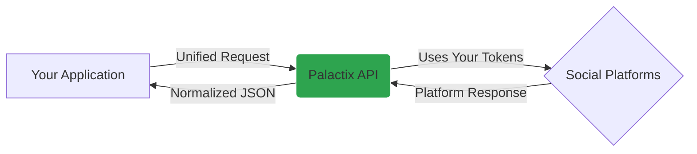

# How Palactix Works

Palactix provides a unified API for publishing to multiple social platforms (Meta, Instagram, LinkedIn, TikTok, X, Reddit).

Instead of building separate integrations for each platform, you call one API. Palactix handles platform-specific logic.

---

## Architecture Flow


**Key point:** Palactix uses **your OAuth credentials**, not shared vendor credentials.

---

## Bring Your Own OAuth (BYO)

Palactix does not provide shared OAuth applications.

You bring your own:
- Meta App ID + Secret
- LinkedIn Client ID + Secret
- TikTok credentials
- X credentials

**When clients connect:**
- They authorize **your app**, not Palactix
- They see **your app name** on consent screens
- OAuth tokens belong to **your infrastructure**

**Result:** Client connections are portable. Switch tools anytime.

---

## Request Lifecycle (Example)

**You send this:**
```json
POST /v1/publish
Authorization: Bearer your_palactix_token

{
  "account_id": "acc_instagram_123",
  "content": {
    "text": "Product launch! 🚀",
    "media_url": "https://cdn.example.com/image.jpg"
  }
}
```

**Palactix does this:**

1. **Validates** - Checks account exists, token valid, media accessible
2. **Retrieves your OAuth token** - Gets the Instagram token for this account
3. **Translates to Instagram format** - Converts to Instagram's API structure
4. **Executes** - Calls Instagram API with your OAuth token
5. **Normalizes response** - Returns consistent format

**You receive:**
```json
{
  "success": true,
  "platform_post_id": "instagram_12345",
  "published_at": "2026-03-08T10:30:00Z"
}
```

**Same request format works for LinkedIn, TikTok, or any supported platform.**

---
## What Palactix Handles

### Token Management

- Securely stores encrypted OAuth tokens  
- Automatically refreshes tokens before expiration  
- Detects revoked or invalid tokens

### Rate Limiting

- Tracks platform rate limits automatically  
- Queues requests when limits are approached  
- Spaces API calls to prevent throttling

### Error Handling

- Retries transient platform failures  
- Returns normalized error responses  
- Logs platform-specific errors for debugging

### Platform Differences

- Handles Instagram Reels vs standard posts  
- Manages LinkedIn pages vs personal profiles  
- Supports TikTok media upload flows

**You call one API. Palactix handles the platform complexity.**
---

## What This Solves

| Without Palactix | With Palactix |
|------------------|---------------|
| Build separate integrations for each platform | One unified API for all platforms |
| Handle multiple OAuth implementations | Single authentication model |
| Manage different rate limit systems | Rate limiting handled automatically |
| Maintain platform-specific API logic | Platform differences abstracted away |
| Update code when platforms change APIs | Platform changes handled by Palactix |

---

## Next Steps

- [Create a Developer App](/docs/developer-setup)
- [Configure Platform Credentials](/docs/platform-credentials)
- [Authentication Guide](/docs/authentication)
- [Publish Your First Post](/docs/publishing)